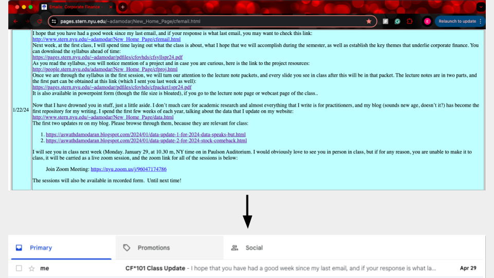

# Description

## Inspiration
I enrolled myself in a self-paced [Corporate Finance](https://pages.stern.nyu.edu/~adamodar/New_Home_Page/corpfin.html) course taught by Aswath Damodaran. I wanted to follow the course as closely as possible to how it was offered and noticed that the professor posted a full list of the emails he sent throughout the semester.

## Implementation
I used Python to webscrape the full list of emails to retrieve the date they were sent and the content of the email. These dates were then shifted to match a start date of May 6, 2024 to follow when I planned to take the course. A Google Action Script is used to check if any emails need to be sent each day and sends them to my email.

### Research
- https://github.com/siquylee/mail-scheduler (Attempt 1)
    - Indirect way to schedule the emails manually
- AppEngine Cron Job / Google Cloud Scheduler   
    - Too complex for this (a whole server for some emails lol)
- https://stackoverflow.com/questions/62154288/can-i-schedule-a-mail-delivery-without-using-gas-trigger (Actual Implementation)
- https://issuetracker.google.com/issues/140922183 (Actual Implementation)